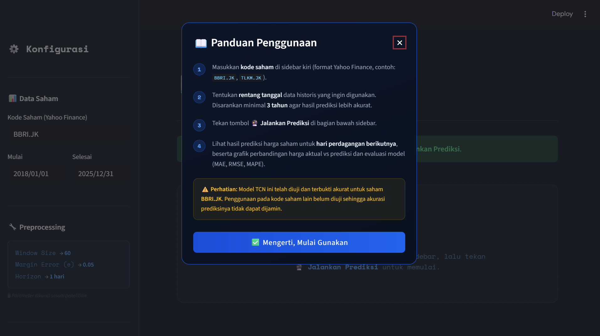

# 📈 TCN Stock Price Predictor

Aplikasi web prediksi harga saham menggunakan arsitektur **Temporal Convolutional Network (TCN)** yang dibangun dengan Streamlit. Model dilatih pada data historis saham **BBRI.JK** dan mampu memprediksi harga *close* untuk hari perdagangan berikutnya.

> ⚠️ **Catatan:** Model telah diuji untuk saham **BBRI.JK**. Penggunaan pada kode saham lain belum diuji sehingga akurasi prediksinya tidak dapat dijamin.

---

## 🌐 Demo Aplikasi

Aplikasi dapat diakses secara langsung melalui tautan berikut:

**🔗 [https://tcn-stock-predictor.streamlit.app/](https://tcn-stock-predictor.streamlit.app/)**

---

## 🛠️ Teknologi yang Digunakan

| Teknologi | Kegunaan |
|-----------|----------|
| Python 3.10+ | Bahasa pemrograman utama |
| Streamlit | Framework aplikasi web |
| TensorFlow / Keras | Framework deep learning |
| keras-tcn | Implementasi arsitektur TCN |
| yfinance | Pengambilan data historis saham |
| scikit-learn | Preprocessing data (MinMaxScaler) |
| Plotly | Visualisasi grafik interaktif |

---

## 🧠 File Model

File `tcn_model.keras` sudah **disertakan langsung di dalam repository** ini, sehingga kamu tidak perlu menyiapkannya secara terpisah. Cukup clone repository dan langsung jalankan aplikasinya.

---

## 📁 Struktur Folder

```
📁 project/
├── app.py               ← aplikasi utama
├── tcn_model.keras      ← model TCN (sudah tersedia)
├── requirements.txt
└── README.md
```

---

## 🖼️ Tampilan Aplikasi


*Tampilan awal aplikasi saat pertama kali dibuka, menampilkan popup panduan penggunaan.*

---

## ⚙️ Parameter Model

Model TCN yang digunakan memiliki parameter tetap sesuai hasil penelitian:

| Parameter | Nilai |
|-----------|-------|
| Window Size | 60 |
| Margin Error Slovin | 0.05 |
| Nb Filters | 64 |
| Kernel Size | 3 |
| Nb Stacks | 1 |
| Dilations | [1, 2, 4, 8, 16, 32] |
| Dropout Rate | 0.2 |
| Max Epochs | 80 |
| Batch Size | 32 |
| Early Stopping Patience | 10 |
| Optimizer | Adam |
| Loss Function | Huber (δ=1.0) |

---

## 🚀 Cara Menjalankan di Lokal

### Prasyarat
- Python 3.10 atau lebih baru sudah terinstall
- File `tcn_model.keras` sudah tersedia (lihat bagian [Menyiapkan File Model](#-menyiapkan-file-model))

### 1. Clone Repository

```bash
git clone https://github.com/IrtantiCarona/TCN-Stock-Predictor.git
cd TCN-Stock-Predictor
```

### 2. Install Dependensi

```bash
pip install -r requirements.txt
```

Atau jika menggunakan `python`/`py`:

```bash
python -m pip install -r requirements.txt
# atau
py -m pip install -r requirements.txt
```

### 3. Jalankan Aplikasi

```bash
streamlit run app.py
```

Atau:

```bash
python -m streamlit run app.py
```

Aplikasi akan otomatis terbuka di browser pada alamat `http://localhost:8501`.

---

## 📊 Fitur Aplikasi

- **Popup panduan** — muncul otomatis saat pertama kali membuka aplikasi
- **Input fleksibel** — pilih kode saham dan rentang tanggal secara bebas
- **Prediksi harga** — menampilkan prediksi harga *close* untuk hari perdagangan berikutnya
- **Informasi tanggal** — menampilkan tanggal data terakhir dan tanggal prediksi secara eksplisit
- **Evaluasi model** — menampilkan nilai MAE, RMSE, dan MAPE
- **Grafik interaktif** — perbandingan harga aktual vs prediksi menggunakan Plotly
- **Ringkasan data** — menampilkan sampel data historis yang digunakan

---

## 👩‍💻 Informasi Pembuat

| | |
|---|---|
| **Nama** | Irtanti Carona |
| **Program Studi** | *Teknologi Informasi* |
| **Institusi** | *Universitas Muhammadiyah Sumatera Utara* |
| **Tahun** | 2026 |

## 📄 Lisensi

Proyek ini dilisensikan di bawah **MIT License** — bebas digunakan, dimodifikasi, dan didistribusikan dengan tetap mencantumkan atribusi kepada pembuat asli.
